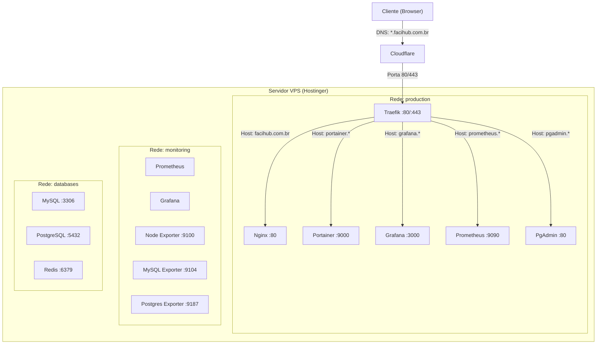
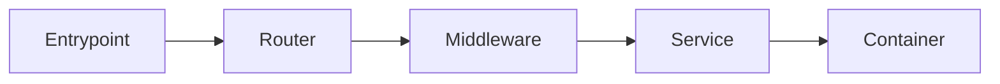
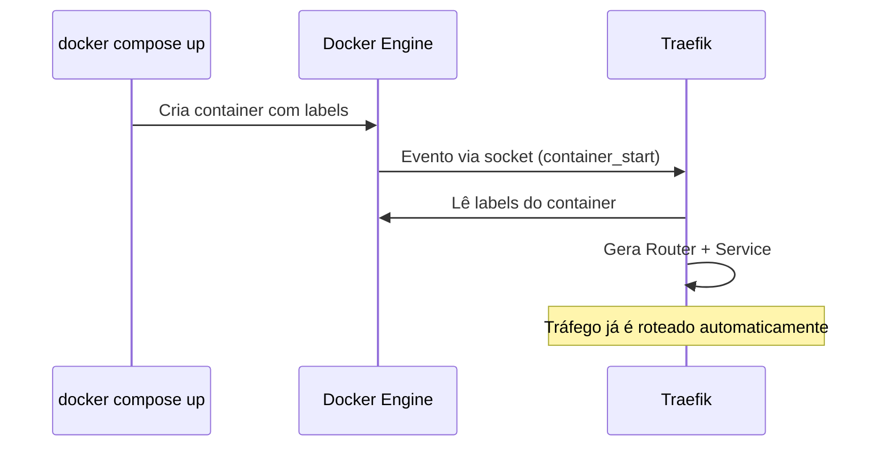
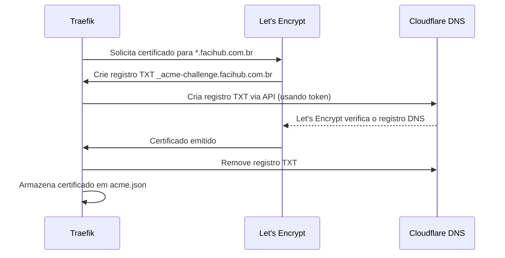
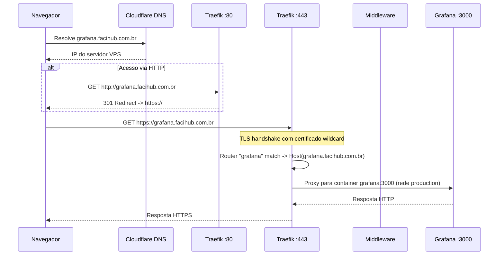
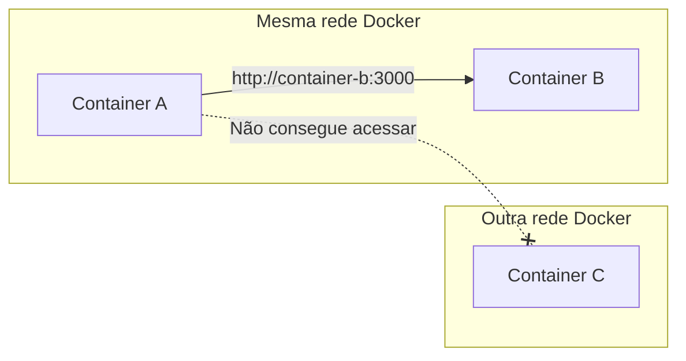
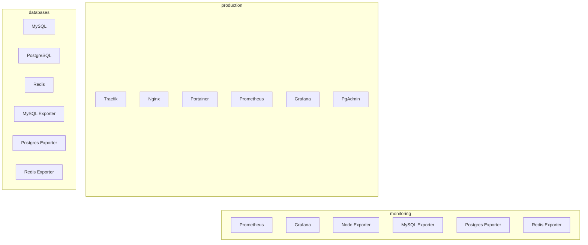
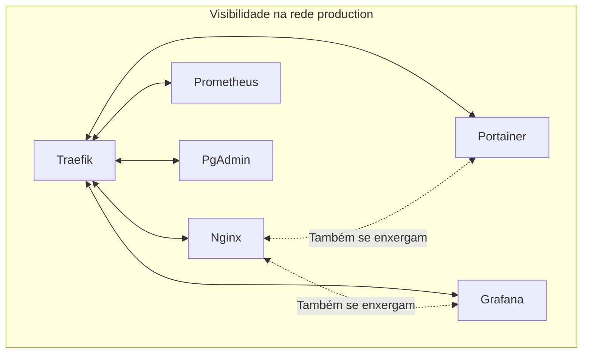

# Traefik -- Como Funciona com Docker

## Sumário

- [Traefik -- Como Funciona com Docker](#traefik----como-funciona-com-docker)
  - [Sumário](#sumário)
  - [O que é o Traefik](#o-que-é-o-traefik)
  - [Arquitetura Geral](#arquitetura-geral)
  - [Conceitos-Chave](#conceitos-chave)
    - [Entrypoints](#entrypoints)
    - [Routers](#routers)
    - [Services](#services)
    - [Middlewares](#middlewares)
    - [Providers](#providers)
    - [Certificate Resolvers](#certificate-resolvers)
  - [Docker Provider -- Auto-Discovery](#docker-provider----auto-discovery)
    - [Docker Socket](#docker-socket)
    - [Importante: Labels do Traefik vs Rede Docker](#importante-labels-do-traefik-vs-rede-docker)
    - [Label traefik.enable](#label-traefikenable)
    - [Label traefik.docker.network](#label-traefikdockernetwork)
  - [TLS e Certificados](#tls-e-certificados)
    - [DNS-01 Challenge com Cloudflare](#dns-01-challenge-com-cloudflare)
    - [Wildcard e acme.json](#wildcard-e-acmejson)
  - [Fluxo Completo de uma Requisição](#fluxo-completo-de-uma-requisição)
  - [Dashboard do Traefik](#dashboard-do-traefik)
  - [Métricas Prometheus](#métricas-prometheus)
  - [Docker Networks, Isolamento e Comunicação Interna](#docker-networks-isolamento-e-comunicação-interna)
    - [DNS Interno do Docker](#dns-interno-do-docker)
    - [Mapa das Redes](#mapa-das-redes)
    - [Isolamento e Visibilidade](#isolamento-e-visibilidade)
    - [Comunicação entre Applications e Databases](#comunicação-entre-applications-e-databases)
    - [Evolução Futura -- Rede `applications`](#evolução-futura----rede-applications)
  - [Mapa de Serviços](#mapa-de-serviços)

---

## O que é o Traefik

O Traefik é um **reverse proxy** e **load balancer** dinâmico projetado para ambientes de containers. Diferente de proxies tradicionais como Nginx ou HAProxy, o Traefik **descobre automaticamente** os serviços que precisa rotear ao se conectar a orquestradores como o Docker.

Na nossa infraestrutura, o Traefik é o único ponto de entrada para todo tráfego HTTP/HTTPS externo. Ele recebe as requisições nas portas 80 e 443, identifica para qual serviço encaminhar com base no domínio requisitado, e faz o proxy para o container correto dentro da rede Docker.

---

## Arquitetura Geral



> As portas indicadas nos containers são **portas internas** -- não são expostas ao host. Apenas o Traefik expõe as portas 80 e 443.

---

## Conceitos-Chave

O Traefik organiza o roteamento em uma cadeia de componentes. Entender cada um é fundamental para configurar qualquer serviço.



### Entrypoints

Entrypoints são as **portas de escuta** do Traefik. São definidos no command do `docker-compose.yml` do Traefik:

| Entrypoint  | Porta   | Função                              |
|-------------|---------|-------------------------------------|
| `web` | `:80` | Recebe HTTP, redireciona para HTTPS |
| `websecure` | `:443` | Recebe HTTPS, entrypoint principal |
| `metrics` | `:8080` | Expõe métricas para o Prometheus |

Configuração real:

```yaml
# Infrastructure/traefik/docker-compose.yml
- "--entrypoints.web.address=:80"
- "--entrypoints.websecure.address=:443"
- "--entrypoints.metrics.address=:8080"

# Redirecionamento automático HTTP -> HTTPS
- "--entrypoints.web.http.redirections.entrypoint.to=websecure"
- "--entrypoints.web.http.redirections.entrypoint.scheme=https"
```

Com essa configuração, toda requisição que chega em `:80` (HTTP) é automaticamente redirecionada para `:443` (HTTPS). Nenhum serviço precisa lidar com HTTP.

### Routers

Routers definem **regras** para decidir qual requisição vai para qual serviço. São configurados via **labels** nos containers Docker.

Uma regra de roteamento típica usa o **Host header** da requisição:

```yaml
# No container do Nginx
labels:
  - traefik.http.routers.nginx.rule=Host(`facihub.com.br`)
  - traefik.http.routers.nginx.entrypoints=websecure
```

O Traefik lê essas labels e cria automaticamente um router chamado `nginx` que:
1. Escuta no entrypoint `websecure` (porta 443)
2. Aceita requisições com o header `Host: facihub.com.br`
3. Encaminha para o service associado

**Anatomia do nome**: `traefik.http.routers.<NOME_DO_ROUTER>.rule` -- o `<NOME_DO_ROUTER>` é um identificador livre que você escolhe. Por convenção, usamos o mesmo nome do serviço.

### Services

Services definem o **backend** para onde o tráfego é encaminhado. Em termos práticos, indicam a **porta interna** do container:

```yaml
labels:
  - traefik.http.services.nginx.loadbalancer.server.port=80
```

Isso diz ao Traefik: "quando um router encaminhar para este service, envie para a porta 80 deste container dentro da rede Docker".

**Importante**: Se o container expõe apenas UMA porta, o Traefik consegue detectar automaticamente e a label de service é opcional. Quando expõe múltiplas portas, a label é **obrigatória**.

### Middlewares

Middlewares processam a requisição **entre** o router e o service. São opcionais. Exemplos usados na nossa infra:

**BasicAuth** (protege Prometheus e Dashboard do Traefik):

```yaml
labels:
  # Define o middleware
  - traefik.http.middlewares.prometheus-auth.basicauth.users=admin:$$2a$$10$$hash...
  # Associa ao router
  - traefik.http.routers.prometheus.middlewares=prometheus-auth
```

**Cadeia**: É possível encadear múltiplos middlewares separando por vírgula:

```yaml
- traefik.http.routers.meuapp.middlewares=auth,rate-limit,compress
```

### Providers

Providers são as **fontes de configuração** do Traefik. O Docker Provider é o que usamos -- ele descobre serviços automaticamente via labels nos containers.

```yaml
command:
  - "--providers.docker=true"
  - "--providers.docker.exposedbydefault=false"
  - "--providers.docker.network=production"
```

| Parâmetro                           | Valor        | Significado                                 |
|-------------------------------------|--------------|---------------------------------------------|
| `providers.docker` | `true` | Ativa a integração com Docker |
| `providers.docker.exposedbydefault` | `false` | Containers NÃO são expostos automaticamente |
| `providers.docker.network` | `production` | Rede padrão para comunicação com containers |

### Certificate Resolvers

Certificate Resolvers automatizam a obtenção de certificados TLS. Usamos o Let's Encrypt com DNS-01 challenge via Cloudflare:

```yaml
command:
  - "--certificatesresolvers.letsencrypt.acme.dnschallenge=true"
  - "--certificatesresolvers.letsencrypt.acme.dnschallenge.provider=cloudflare"
  - "--certificatesresolvers.letsencrypt.acme.dnschallenge.resolvers=1.1.1.1:53,1.0.0.1:53"
  - "--certificatesresolvers.letsencrypt.acme.email=dev.celao@gmail.com"
  - "--certificatesresolvers.letsencrypt.acme.storage=/letsencrypt/acme.json"
```

O resolver chamado `letsencrypt` é referenciado nas labels dos serviços:

```yaml
- traefik.http.routers.nginx.tls.certresolver=letsencrypt
```

---

## Docker Provider -- Auto-Discovery

### Docker Socket

O Traefik se conecta ao Docker Engine através do **socket Unix**:

```yaml
volumes:
  - /var/run/docker.sock:/var/run/docker.sock:ro
```

Através desse socket (montado como **read-only** por segurança), o Traefik:

1. **Escuta eventos** do Docker em tempo real (container criado, destruído, etc.)
2. **Lê as labels** de cada container
3. **Gera a configuração** de roteamento automaticamente



Quando um container é parado ou removido, o Traefik remove o roteamento automaticamente. **Não é preciso reiniciar o Traefik.**

### Importante: Labels do Traefik vs Rede Docker

Antes de detalhar as labels, é fundamental entender que **labels do Traefik e redes Docker são mecanismos completamente independentes**:

- **Rede Docker** = comunicação **interna** entre containers. Se dois containers estão na mesma rede, eles se acessam por nome (ex: `http://minha-api:3000`). Isso funciona sem qualquer envolvimento do Traefik.
- **Labels do Traefik** = exposição **externa**. Dizem ao Traefik para rotear tráfego vindo da internet (via subdomínio) para um container específico.

Um container na rede `production` **sem nenhuma label do Traefik** se comunica normalmente com todos os outros containers dessa rede. As labels controlam apenas se o Traefik vai criar uma rota externa para ele.

Serviços internos (workers, filas de mensagens, servidores de email, background jobs) **não devem ter labels do Traefik** -- basta configurá-los na rede correta.

### Label traefik.enable

Como `exposedbydefault=false`, todo container é **invisível** para o Traefik por padrão. Para ser descoberto e ter rotas externas criadas, o container precisa da label:

```yaml
labels:
  - traefik.enable=true
```

Sem essa label, o Traefik ignora o container completamente, mesmo que ele tenha outras labels configuradas.

> **Atenção**: `traefik.enable=true` sozinho, sem labels de router/service, não tem efeito útil. O container aparece no dashboard do Traefik mas sem rota funcional. Todas as labels de roteamento devem ser configuradas juntas.

### Label traefik.docker.network

O Traefik é configurado com uma rede padrão (`providers.docker.network=production`). Quando um container está em **apenas uma rede**, o Traefik sabe automaticamente qual usar.

O problema surge quando um container participa de **múltiplas redes**. Exemplo: o Grafana está em `production` e `monitoring`:

```yaml
# Infrastructure/grafana/docker-compose.yml
networks:
  monitoring:
    external: true
  production:
    external: true
services:
  grafana:
    networks:
      - monitoring
      - production
    labels:
      - traefik.docker.network=production  # Obrigatório aqui
```

Sem `traefik.docker.network=production`, o Traefik pode tentar se comunicar pela rede `monitoring`, onde ele **não está conectado**, e a requisição falha.

**Regra prática**: Se o container está em mais de uma rede, **sempre** adicione `traefik.docker.network=production`.

---

## TLS e Certificados

### DNS-01 Challenge com Cloudflare

O DNS-01 challenge funciona assim:



O token da API do Cloudflare é armazenado como **Docker Secret**:

```yaml
# Infrastructure/traefik/docker-compose.yml
secrets:
  cloudflare-token:
    file: secrets/cloudflare-token.secret

environment:
  - CF_DNS_API_TOKEN_FILE=/run/secrets/cloudflare-token
```

Vantagem do DNS-01 sobre HTTP-01: permite emitir certificados **wildcard** (`*.facihub.com.br`), cobrindo todos os subdomínios sem precisar configurar individualmente.

### Wildcard e acme.json

O certificado wildcard é configurado no entrypoint `websecure`:

```yaml
- "--entrypoints.websecure.http.tls.domains[0].main=facihub.com.br"
- "--entrypoints.websecure.http.tls.domains[0].sans=*.facihub.com.br"
```

Isso gera **um único certificado** que cobre:
- `facihub.com.br` (domínio principal)
- `*.facihub.com.br` (todos os subdomínios: grafana, portainer, prometheus, etc.)

O certificado é armazenado em `/letsencrypt/acme.json` dentro do container, mapeado para `./certs/acme.json` no host. O Dockerfile garante as permissões corretas:

```dockerfile
# Infrastructure/traefik/Dockerfile
FROM traefik:3.6

RUN mkdir -p /letsencrypt && \
    touch /letsencrypt/acme.json && \
    chmod 600 /letsencrypt/acme.json
```

> **Permissão 600** é obrigatória. O Traefik recusa iniciar se `acme.json` tiver permissões mais abertas.

O pipeline de deploy (`deploy.yml`) faz backup e restore desse arquivo para não perder certificados entre deploys e evitar rate-limit do Let's Encrypt.

---

## Fluxo Completo de uma Requisição

Exemplo: um usuário acessa `https://grafana.facihub.com.br`.



Passo a passo interno:

1. **DNS**: O Cloudflare resolve `grafana.facihub.com.br` para o IP do servidor VPS
2. **Entrypoint web (:80)**: Se a requisição chega em HTTP, o Traefik responde com redirect 301 para HTTPS
3. **Entrypoint websecure (:443)**: O Traefik faz o handshake TLS usando o certificado wildcard armazenado em `acme.json`
4. **Router matching**: O Traefik compara o header `Host` com todos os routers registrados. O router `grafana` tem a regra `Host(grafana.facihub.com.br)` e faz match
5. **Middlewares**: Se o router tem middlewares configurados, eles são aplicados em sequência (neste caso o Grafana não tem middlewares adicionais)
6. **Service**: O tráfego é encaminhado para `grafana:3000` na rede `production` (definido pela label `traefik.docker.network=production`)
7. **Resposta**: O container do Grafana responde, o Traefik repassa ao usuário com TLS

---

## Dashboard do Traefik

O dashboard é acessível em `https://traefik.facihub.com.br` e mostra todos os routers, services e middlewares ativos.

```yaml
labels:
  - traefik.enable=true
  - traefik.http.routers.traefik.rule=Host(`traefik.facihub.com.br`)
  - traefik.http.routers.traefik.entrypoints=websecure
  - traefik.http.routers.traefik.service=api@internal
  - traefik.http.middlewares.traefik-auth.basicauth.users=admin:$$2a$$10$$hash...
  - traefik.http.routers.traefik.middlewares=traefik-auth
```

Diferenças em relação a serviços normais:

- **`service=api@internal`**: Aponta para o serviço interno do Traefik (o próprio dashboard), não para um container externo
- **`api.dashboard=true`** + **`api.insecure=false`**: O dashboard existe mas só é acessível via router com TLS, nunca diretamente na porta 8080
- **BasicAuth**: Protegido com autenticação (o hash `$$` no compose é o escape de `$` do YAML)

---

## Métricas Prometheus

O Traefik expõe métricas no formato Prometheus em um entrypoint dedicado:

```yaml
command:
  - "--metrics.prometheus=true"
  - "--metrics.prometheus.entryPoint=metrics"
  - "--metrics.prometheus.addEntryPointsLabels=true"
  - "--metrics.prometheus.addRoutersLabels=true"
  - "--metrics.prometheus.addServicesLabels=true"
```

O Prometheus coleta essas métricas diretamente pela rede interna:

```yaml
# Infrastructure/prometheus/config/prometheus.yml
- job_name: 'traefik'
  static_configs:
    - targets: ['traefik:8080']
```

O endereço `traefik:8080` funciona porque o Prometheus resolve o nome `traefik` via DNS interno do Docker na rede onde ambos estão conectados.

Métricas disponíveis incluem: requests por router, latência por serviço, erros por entrypoint, certificados TLS, e mais.

---

## Docker Networks, Isolamento e Comunicação Interna

### DNS Interno do Docker

Cada rede Docker possui um **servidor DNS embutido**. Quando containers estão na mesma rede, eles podem se comunicar **pelo nome do container** (ou pelo nome do serviço no compose).

Exemplo: o Prometheus (na rede `monitoring`) acessa o Node Exporter pelo endereço `node_exporter:9100`. Não é preciso saber o IP do container -- o Docker resolve automaticamente.



**Regra fundamental**: Containers **só se enxergam se estão na mesma rede**. Um container na rede `production` não consegue acessar um container que está apenas na rede `databases`, e vice-versa.

### Mapa das Redes

A infraestrutura utiliza 3 redes externas Docker. Cada uma tem um propósito:



| Rede         | Propósito                                                  | Quem participa                                          |
|--------------|------------------------------------------------------------|---------------------------------------------------------|
| `production` | Comunicação entre Traefik e serviços expostos externamente | Traefik, Nginx, Portainer, Grafana, Prometheus, PgAdmin |
| `monitoring` | Comunicação interna entre ferramentas de monitoramento | Prometheus, Grafana, Node Exporter, MySQL/Postgres/Redis Exporters |
| `databases` -| Isolamento dos bancos de dados | MySQL, PostgreSQL, Redis, PgAdmin (via `production` também), Exporters |

Containers como **Grafana** e **Prometheus** participam de **duas redes** simultaneamente:
- `production` -- para serem acessíveis via Traefik (receber tráfego externo)
- `monitoring` -- para se comunicarem com exporters (coleta de métricas interna)

### Isolamento e Visibilidade

Quem enxerga quem dentro das redes:



**Impacto prático**: Todos os containers na rede `production` podem se comunicar livremente entre si. O Nginx consegue acessar `portainer:9000`, o Portainer consegue acessar `grafana:3000`, etc. Isso não é um problema de segurança grave na configuração atual (todos são serviços confiáveis de infraestrutura), mas é importante ter consciência.

**O que está isolado**:
- MySQL, PostgreSQL e Redis (`databases`) **não são acessíveis** por Nginx, Portainer ou Traefik
- Node Exporter (`monitoring`) **não é acessível** pelo Nginx ou Portainer
- Containers que **não estão em nenhuma rede compartilhada** são completamente invisíveis entre si

### Comunicação entre Applications e Databases

Quando uma aplicação (API, backend, etc.) precisa acessar um banco de dados, ela deve participar de **duas redes**:

```yaml
networks:
  production:
    external: true
    name: production
  databases:
    external: true
    name: databases

services:
  minha-api:
    image: minha-api:latest
    networks:
      - production    # Para ser acessível via Traefik
      - databases     # Para acessar MySQL/PostgreSQL/Redis
    labels:
      - traefik.enable=true
      - traefik.http.routers.minha-api.rule=Host(`api.facihub.com.br`)
      - traefik.http.routers.minha-api.entrypoints=websecure
      - traefik.http.routers.minha-api.tls=true
      - traefik.http.services.minha-api.loadbalancer.server.port=3000
      - traefik.docker.network=production  # Obrigatório: múltiplas redes
```

Nessa configuração:
- O Traefik roteia tráfego externo para a API pela rede `production`
- A API acessa o banco via `mysql:3306` ou `postgres:5432` pela rede `databases`
- O banco **não é acessível** pela internet (não tem labels do Traefik)

### Evolução Futura -- Rede `applications`

A arquitetura atual coloca todas as aplicações junto com os serviços de infraestrutura na rede `production`. Se no futuro houver necessidade de **isolamento entre apps e infra**, é possível criar uma rede `applications` dedicada:

```
production    -> Apenas Traefik + serviços de infraestrutura (Portainer, Grafana, etc.)
applications  -> Apps de negócio (APIs, frontends, microserviços)
```

Nesse modelo, o Traefik entraria em ambas as redes, e cada app usaria `traefik.docker.network=applications`. Isso impediria que apps acessem diretamente serviços de infra como Portainer ou Grafana.

Essa separação só vale a pena quando houver **serviços de terceiros ou menos confiáveis** rodando no mesmo servidor.

---

## Mapa de Serviços

Todos os serviços atualmente configurados com Traefik:

| Serviço | Subdomínio | Porta Interna | Rede(s) | Middlewares | Compose |
|---|---|---|---|---|---|
| Traefik Dashboard | `traefik.facihub.com.br` | `api@internal` | production | BasicAuth | `Infrastructure/traefik/` |
| Nginx (Landing) | `facihub.com.br` | 80 | production | -- | `Infrastructure/nginx/` |
| Portainer | `portainer.facihub.com.br` | 9000 | production | -- | `Infrastructure/portainer/` |
| Grafana | `grafana.facihub.com.br` | 3000 | production, monitoring | -- | `Infrastructure/grafana/` |
| Prometheus | `prometheus.facihub.com.br` | 9090 | production, monitoring | BasicAuth | `Infrastructure/prometheus/` |
| PgAdmin | `pgadmin.facihub.com.br` | 80 | databases, production | -- | `Databases/postgres/` |

Serviços **internos** (sem exposição via Traefik):

| Serviço | Porta | Rede(s) | Função |
|---|---|---|---|
| MySQL | 3306 | databases | Banco de dados relacional |
| PostgreSQL | 5432 | databases | Banco de dados relacional |
| Redis | 6379 | databases | Cache e store chave-valor |
| Node Exporter | 9100 | monitoring | Métricas do host (CPU, RAM, disco) |
| MySQL Exporter | 9104 | databases, monitoring | Métricas do MySQL para Prometheus |
| Postgres Exporter | 9187 | databases, monitoring | Métricas do PostgreSQL para Prometheus |
| Redis Exporter | 9121 | databases, monitoring | Métricas do Redis para Prometheus |
